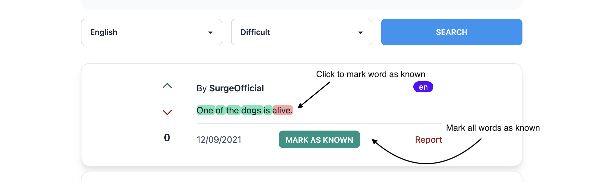

# surgelingo-backend
This is the backend of my solo submission for the 48-hour [Develop to Disrupt 2021 hackathon](https://develop-to-disrupt.devpost.com/), my first hackathon, built with Python + Flask. You can view the frontend [here](https://develop-to-disrupt.devpost.com/).

**Update 13/9:** I won one of the five main prizes :tada:, from nearly 100 participants! This project earned me the **Best Solo Hack** award, a pair of Beats headphones, tickets to [Canada's Innovation Summit](https://www.corridorsummit.ca/), and a year of Wolfram|One Pro. Thanks to everyone who made this possible and the support given along the way!

You can view the winning entry page, with a video, photos, and a more detailed description [here](https://devpost.com/software/surgelingo).

## About SurgeLingo
_SurgeLingo_ addresses a fundamental issue that many language learners, especially beginner and intermediate ones, face: lack of comprehensible content. "Comprehensible content" is any form of audiovisual media that they can understand.

This submission solves that problem by creating a Twitter-esque feed of sentences in the learner's target language. These sentences are taken from the [Tatoeba database](https://tatoeba.org/en/), which has millions of sentences available for download, but they can also be user-contributed.

The radical new way in which SurgeLingo helps language learners 'surge ahead' in their studies is by:
- Sorting the sentences based off of difficulty.
- Allowing for different difficulties of sentences - from everything known for when the user is tired, to those where 70% of the content is known, and so on.
- Offering advanced sentence searching - by author, tags, content, and language - so that the user can learn sentences (or 'surges') in a field they are studying for.

And, of course, the truly killer feature - easy wordbank updating. In order to allow the user to seamlessly discover new 'surges', the application allows for a wealth of ways for the user to demonstrate their knowledge.



1. On the wordbank page, users can type in words they know, or paste from a frequency list. Future searches will use these words to calculate user knowledge.
2. An individual word in the result can be clicked to be added to the database.
3. To work at a faster pace, or for students who study sentence 'surges' in depth, the whole content can be marked as known.

As a language learner myself, this is something that I've found personally useful when I've made a [CLI tool at a smaller scale ](https://github.com/Destaq/chinese-sentence-miner) for Chinese - and the number of stars, despite how simple the project is, attest to that.

Due to how short sentences are, the length is perfect for a user that wants to learn between meetings, at a bus stop, etc. The range of customization makes it useful for advanced and studious learners as well, since setting a goal of 'intensively reading' and analyzing N cards a day or learning cards related to some search term has learning benefits.


## Stack
The frontend was built with Nuxt and Vue 2. TailwindCSS was used for styling, and the modules `nuxt-auth` and `nuxt-axios` were used for smooth user authentication and requests to the backend.

The backend was built with the Flask Python microframework, and used a PostgreSQL database to store user info, surges, and so on.

The `nltk` Python package, a natural language processing library, was leveraged so that surge sentences and user wordbanks would be [stemmed](https://en.wikipedia.org/wiki/Stemming), a process that reduces the words inside to their root form. This allowed for support of languages that have conjugation. A number of other packages that extend Flask or allow for content generation were also used.

## Running Locally
*Steps provided are for both frontend and backend.*

*The example only provides English, Spanish, French, and German support, but this is extremely easy to modify for your own use case - just make sure it is one of the [fifteen languages](https://www.nltk.org/howto/stem.html) supported by SnowballStemmer.*
1. [Install Postgres](https://postgresapp.com/documentation/cli-tools.html)
2. [Set up Postgres CLI](https://postgresapp.com/documentation/cli-tools.html)
3. Clone or download the [frontend](https://github.com/Destaq/surgelingo-backend) and backend
4. Navigate to wherever you have stored the backend, and make sure you have Python 3 installed (`python3 -V`)
    - `python3 -m pip install -r requirements.txt`
    - `createdb surgelingo`
    - export the following environment variables
    ```
    export APP_SETTINGS="config.DevelopmentConfig"
    export DATABASE_URL="postgresql:///surgelingo"
    export FLASK_APP=app
    export SECRET_KEY="something-secret"
    export JWT_SECRET_KEY="also-secret"
    ```
    - `flask db init`
    - `flask db migrate`
    - `flask db upgrade`
    - `python3 main.py`
    - Awesome! Backend is set up. Moving on...
5. Install Nuxt and Vue. I'm pressed for time, a Google search should help you out here!
6. Navigate to the folder that holds your frontend.
    - `npm install`
    - `npm run dev`

And you have the project running in your local environment! I hope it'll be as interesting and useful to you as it was fun for me building.
